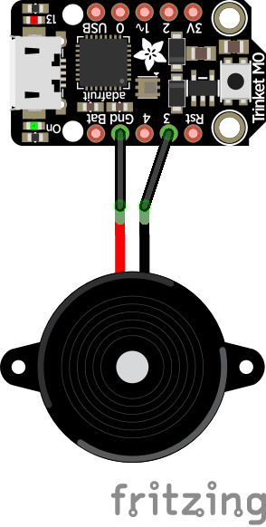

# Simon says game for the Adafruit PyRuler

## Overview
The new Adafruit PyRuler comes with 4 capacitive touch pads. There 
are for colored leds above the pads. This makes the PyRuler perfect 
for implementing a Simon says game in Circuit Python. The libraries
included in this project are for Circuit Python 4.x (bundle-4.x-mpy-20190815).

## Project Parts
* [Adafruit PyRuler](https://www.adafruit.com/product/4319)
* [Piezo Buzzer](adafruit.com/product/160)
* [USB cable](adafruit.com/product/592)

## Circuit Diagram
The PyRuler is a fully featured microcontroller board! Embedded in the end is a 
Trinket M0. For the pourpose of this project, the piezo buzzer is connected to 
the ground pin and the analog pin 3.

## Code with Circuit Python
Explain how the code works here.
